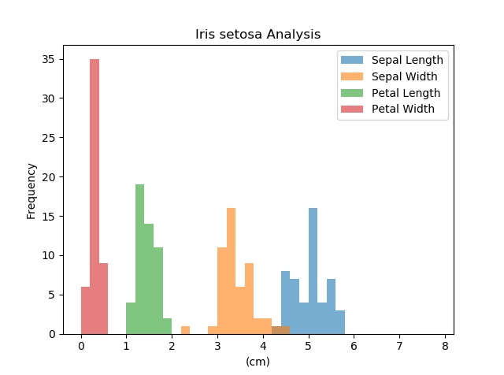
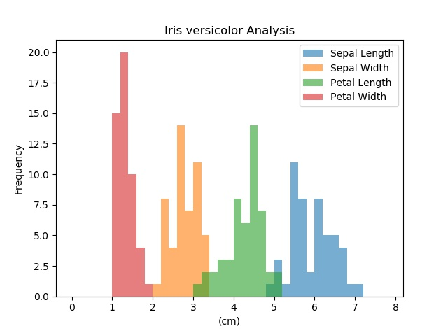

Iris Data Set Project
========================
Programming &amp; Scripting 2018

## Purpose
This repository contains a python program, data and materials relating to Fisher's iris dataset.
This is for the final assignment for GMIT's Programming and Scripting module 2018 as part of the Higher Diploma in Data Analytics. The purpose of the project is to research and analyse the iris dataset and present the results.

## Fisher’s Iris Data Set

### History of Data
British statistician and biologist Ronald Fisher (FISHER, 1936)\
Data collected Gaspé Peninsula, Quebec, Canad by Edgar Anderson to quantify morphologic variation of Iris flowers of three related species (Anderson, 1936)\
Typical test case for many statistical classification techniques in machine learning such as support vector machines (Archive.ics.uci.edu, 2018)

### Description of Data
50 samples each of 3 different Iris species (Iris setosa, Iris virginica and Iris versicolor) (En.wikipedia.org, 2018)\
Length & width of sepal and petal (cm)\
Best known database to be found in pattern recognition literature.

### Analyses of Data
#### Fisher
Multivariate – Observation and analysis of more than one outcome variable\
Example of linear discriminant analysis – Pattern recognition to find a linear combination of features that characterises classes of objects. Used to distinguish Iris species from each other by features.\
One class is linearly separable from the other 2; the latter are not linearly separable from each other. 

### How to Use Python Program IrisAnalysis.py

### Summary of Data

### Graphs
\
\
\

### References
FISHER, R. (1936). THE USE OF MULTIPLE MEASUREMENTS IN TAXONOMIC PROBLEMS. Annals of Eugenics, 7(2), pp.179-188.\
Anderson, E. (1936). The Species Problem in Iris. Annals of the Missouri Botanical Garden, 23(3), p.457.\
Archive.ics.uci.edu. (2018). UCI Machine Learning Repository: Iris Data Set. [online] Available at: https://archive.ics.uci.edu/ml/datasets/iris [Accessed 18 Apr. 2018].
En.wikipedia.org. (2018). Iris flower data set. [online] Available at: https://en.wikipedia.org/wiki/Iris_flower_data_set [Accessed 17 Apr. 2018].
