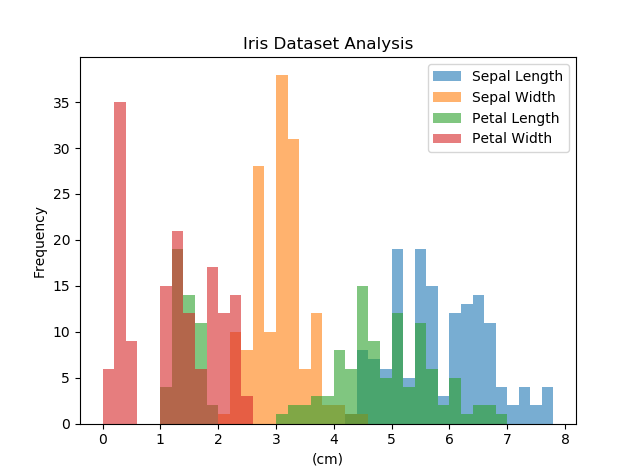
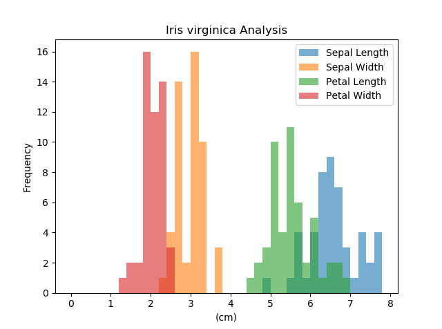

Iris Dataset Project
========================
Programming &amp; Scripting 2018

## Purpose
This repository contains a python program, data and materials relating to Fisher's iris dataset.
This is the final assignment for GMIT's Programming and Scripting module 2018 as part of the Higher Diploma in Data Analytics. The purpose of the project is to research and analyse the iris dataset and present the results.

## Fisher’s Iris Data Set

### History of Data
The iris flower dataset was introduced by British statistician and biologist Ronald Fisher (Fisher, 1936). The data was collected in the Gaspé Peninsula, Quebec, Canada by Edgar Anderson for use in his research to quantify morphologic variation of Iris flowers of three related species (Anderson, 1936).\
Since this time it has become the test case for many statistical classification techniques in machine learning (Archive.ics.uci.edu, 2018). It is now the best known database to be found in pattern recognition literature.

### Description of Data
The dataset contains 50 samples each of 3 different Iris species (Iris setosa, Iris virginica and Iris versicolor) (En.wikipedia.org, 2018). For each sample, the length and width of iris sepal and petal has been measured in cm.

### Analyses of Data
#### Fisher
Fisher used the iris dataset for multivariate analysis, meaning that observation and analysis were carried out simultaneously for more than one outcome variable. 

Example of linear discriminant analysis – Pattern recognition to find a linear combination of features that characterises classes of objects. Used to distinguish Iris species from each other by features.\
One class is linearly separable from the other 2; the latter are not linearly separable from each other. 

## How to Use Python Program IrisAnalysis.py
1. Download project folder from Github to a local location.
2. Open a command line interpreter and navigate to the project folder.
3. Run the program using the command Python IrisAnalysis.py.
4. Wait for the program to carry out its analysis of the full iris dataset.
5. Respond to the prompts for input from the program in the command line as requested. The user will be asked to select which class of iris they would like to carry out analysis on. This can be repeated a number of times if the user wishes.
6. Once the program has finished its analysis it will end.
7. The program will output a file named "Ouptut File.txt" in the project folder which will contain tables of summary statistics of the overall dataset and for each of the iris classes selected by the user previously.
8. The program will also output histograms for the overall dataset and for each of the iris classes selected. These will appear in individual windows and can be saved as images if required.

## Results of Analysis
Below is the contents of "Output File.txt" when analysis has been carried out for each of the iris classes in turn.\
The statistics produced for each column are as follows:
- Count: This gives the total number of data points analysed
- Mean: This gives the arithmetic mean of the data points analysed
- Std: This gives the standard deviation of the data points
- Min: This gives the minimum value of the data points
- 25%: This gives the 25th percentile of the data points, or the value below which 25% of the data points fall
- 50%: This gives the 50th percentile of the data points, or the value below which 50% of the data points fall
- 75%: This gives the 75 percentile of the data points, or the value below which 75of the data points fall
- Max: This gives the maximum value of the data points

#### All Iris Classes

|      | Sepal Length | Sepal Width | Petal Length | Petal Width|
|------|-------------:|------------:|-------------:|-----------:|
|count |      150.00  |    150.00   |    150.00    |  150.00    |
|mean  |        5.84  |      3.05   |      3.76    |    1.20    |
|std   |        0.83  |      0.43   |      1.76    |    0.76    |
|min   |        4.30  |      2.00   |      1.00    |    0.10    |
|25%   |        5.10  |      2.80   |      1.60    |    0.30    |
|50%   |        5.80  |      3.00   |      4.35    |    1.30    |
|75%   |        6.40  |      3.30   |      5.10    |    1.80    |
|max   |        7.90  |      4.40   |      6.90    |    2.50    |

#### Iris Setosa

|      | Sepal Length | Sepal Width | Petal Length | Petal Width|
|------|-------------:|------------:|-------------:|-----------:|
|count |       50.00  |     50.00   |     50.00    |   50.00    |
|mean  |        5.01  |      3.42   |      1.46    |    0.24    |
|std   |        0.35  |      0.38   |      0.17    |    0.11    |
|min   |        4.30  |      2.30   |      1.00    |    0.10    |
|25%   |        4.80  |      3.12   |      1.40    |    0.20    |
|50%   |        5.00  |      3.40   |      1.50    |    0.20    |
|75%   |        5.20  |      3.68   |      1.58    |    0.30    |
|max   |        5.80  |      4.40   |      1.90    |    0.60    |

#### Iris Versicolor

|      | Sepal Length | Sepal Width | Petal Length | Petal Width|
|------|-------------:|------------:|-------------:|-----------:|
|count |       50.00  |     50.00   |     50.00    |   50.00    |
|mean  |        5.94  |      2.77   |      4.26    |    1.33    |
|std   |        0.52  |      0.31   |      0.47    |    0.20    |
|min   |        4.90  |      2.00   |      3.00    |    1.00    |
|25%   |        5.60  |      2.52   |      4.00    |    1.20    |
|50%   |        5.90  |      2.80   |      4.35    |    1.30    |
|75%   |        6.30  |      3.00   |      4.60    |    1.50    |
|max   |        7.00  |      3.40   |      5.10    |    1.80    |

#### Iris Virginica

|      | Sepal Length | Sepal Width | Petal Length | Petal Width|
|------|-------------:|------------:|-------------:|-----------:|
|count |       50.00  |     50.00   |     50.00    |   50.00    |
|mean  |        6.59  |      2.97   |      5.55    |    2.03    |
|std   |        0.64  |      0.32   |      0.55    |    0.27    |
|min   |        4.90  |      2.20   |      4.50    |    1.40    |
|25%   |        6.22  |      2.80   |      5.10    |    1.80    |
|50%   |        6.50  |      3.00   |      5.55    |    2.00    |
|75%   |        6.90  |      3.18   |      5.88    |    2.30    |
|max   |        7.90  |      3.80   |      6.90    |    2.50    |

## Graphs

## References
Fisher, R. (1936). THE USE OF MULTIPLE MEASUREMENTS IN TAXONOMIC PROBLEMS. Annals of Eugenics, 7(2), pp.179-188.\
Anderson, E. (1936). The Species Problem in Iris. Annals of the Missouri Botanical Garden, 23(3), p.457.\
Archive.ics.uci.edu. (2018). UCI Machine Learning Repository: Iris Data Set. [online] Available at: https://archive.ics.uci.edu/ml/datasets/iris [Accessed 18 Apr. 2018].
En.wikipedia.org. (2018). Iris flower data set. [online] Available at: https://en.wikipedia.org/wiki/Iris_flower_data_set [Accessed 17 Apr. 2018].
